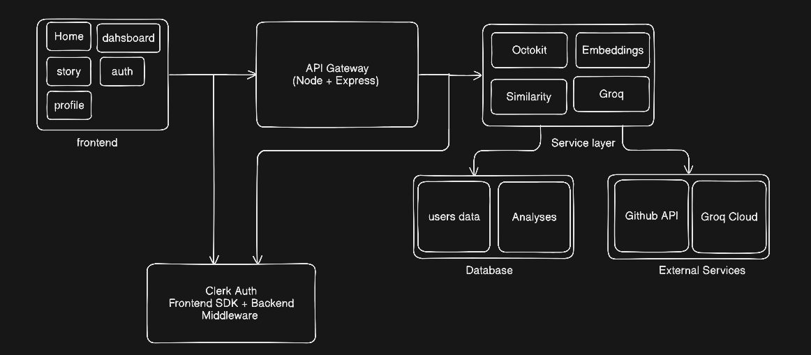

# Architecture

## System Design

FuseMeld is a monorepo with a React frontend and an Express backend, connected via a REST API.

## High-Level Overview


---

```
┌─────────────────────────────────────────────────────┐
│              Frontend (React + Vite)                │
│   Home → Dashboard → Commit Story                  │
│   Clerk SDK handles auth state                      │
└───────────────────┬─────────────────────────────────┘
                    │ Axios + Bearer JWT
┌───────────────────▼─────────────────────────────────┐
│           API Gateway (Express + TypeScript)        │
│   /api/issues   /api/commits   /api/user           │
│   Clerk JWT middleware on all routes                │
└──────┬────────────────────────────┬─────────────────┘
       │                            │
┌──────▼──────┐            ┌────────▼────────┐
│  Services   │            │  External APIs  │
│  ─────────  │            │  ─────────────  │
│  Octokit    │            │  GitHub REST    │
│  Embeddings │            │  Groq Cloud     │
│  Similarity │            │  Clerk Auth     │
│  Groq       │            └─────────────────┘
└──────┬──────┘
       │
┌──────▼──────┐
│  MongoDB    │
│  ─────────  │
│  users      │
│  analyses   │
└─────────────┘
```

## Data Models

### User
```typescript
{
  clerkId: string       // Clerk user ID — primary key
  email: string
  username: string
  savedRepos: string[]  // Array of GitHub repo URLs
  createdAt: Date
}
```

### Analysis
```typescript
{
  repoUrl: string
  owner: string
  repo: string
  totalIssues: number
  clusters: [
    {
      issues: GitHubIssue[]
      similarityScore: number   // 0–1, cosine similarity
      mergeSuggestion: string   // Groq generated
    }
  ]
  commitStory: [
    {
      title: string
      period: string
      commits: string[]
      story: string             // Groq generated narrative
    }
  ]
  cachedAt: Date
}
```

## Key Technical Decisions

| Decision | Choice | Reason |
|---|---|---|
| Embeddings model | `all-MiniLM-L6-v2` via `@xenova/transformers` | Runs locally in Node, no API cost, 384-dim vectors, fast |
| Similarity algorithm | Cosine similarity + Union-Find | O(n²) comparisons fine for <500 issues, Union-Find groups connected pairs cleanly |
| Similarity threshold | 0.82 | Empirically chosen — high enough to avoid false positives, low enough to catch real duplicates |
| LLM | Groq Llama 3.3 70B | Free tier, extremely fast inference, great instruction following |
| Auth | Clerk | GitHub OAuth out of the box, JWT verified server-side, no auth code to maintain |
| Caching | MongoDB (1 hour TTL) | Avoids re-embedding on every visit, embedding is the slow step (~20s for large repos) |
| Module system | ESM (`"type": "module"`) | Modern Node.js, works cleanly with `nodenext` TypeScript module resolution |

---
### Hope You underStood the Design.